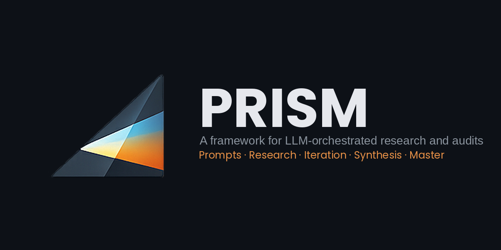

<p align="center">
  
</p>

# PRISM

**PRISM** (Prompts · Research · Iteration · Synthesis · Master) is a structured multi-session, multi-vendor LLM-orchestrated audit and research framework. It splits a research problem into atomic specialist prompts, dispatches each where it runs best across Claude, ChatGPT, Gemini, and Perplexity, and converges their outputs into a single living document called the **Master**.

The framework comes in two forms built from the same source: a single Markdown file (`PRISM.md`) you attach to any LLM chat, and a **Claude Skill plugin** that installs a lean core and fetches reference material on demand. The single file carries its own machine-readable frontmatter, lint contract, embedded [Lens Library](#the-lens-library) (Appendix G), and vendor-parsing escape-hatch (Appendix H) so it self-documents across sessions and vendors; the Skill is a verified, deterministic projection of that same content. See [Which form should I use?](#which-form-should-i-use).

> **New through v2.20.1 — a named operating model, with a matching command set.** Recent releases add the layer that runs an engagement end to end: a **PRISM Desk** (one operator-facing surface that stages every step), a symmetric **Setup → rounds → Closure** lifecycle, a five-stage **dispatch round-trip**, engagement deliverables (a plain-language report plus an optional interactive workbook), and a core-slimming refactor that keeps the always-loaded core lean by fetching phase-scoped material on demand. On the Skill, that lifecycle now has a matching slash-command set. See [How an engagement runs](#how-an-engagement-runs). (Installation is unchanged — see [Quick start](#quick-start).)

## What PRISM is for

- **Multi-vendor research and audits** where one prompt isn't enough and one vendor isn't enough.
- **Coherence across sessions**: continuous Master + *What's next* state means a session you open next week can pick up exactly where the last one closed, even on a fresh chat.
- **Mobile-first operation**: structured filenames, file-based outputs, operator hints, narrow tables, and a "What's next?" prompt are all designed for someone moving artifacts between vendor chats on a phone.
- **Explicit scope-completeness**: the [Lens Library](#the-lens-library) catalogs audit-scope lenses and grades the draft Prompt Strategy against them at Setup, so silent omissions surface before any prompt ships.

Orchestration is built and tested on Claude; execution spans Claude, ChatGPT, Gemini, and Perplexity in deliberate triangulation (see [Orchestration and execution](#orchestration-and-execution) below). Porting orchestration to another vendor is untested but likely, and contributions are welcome.

## Orchestration and execution

PRISM separates two layers, and several things in this README make sense only once that split is clear.

**Orchestration** is the reasoning layer that runs the framework — parsing your problem, sequencing atomic prompts, grading scope against the Lens Library, and maintaining the Master across sessions. It was built and tested on **Claude (Opus-class)**. Running orchestration on another vendor's model is likely workable but is untested; a port is a welcome contribution.

**Execution** is the dispatched work — each atomic prompt sent to whichever model suits it best. Only the orchestration layer runs PRISM; the dispatched prompts are **self-contained, standalone prompts the orchestration layer produced**, so the executing model needs no knowledge of the framework. That is what lets execution be deliberately **multi-vendor** — routing prompts across Claude, ChatGPT, Gemini, and Perplexity in triangulation sequences is a core method.

So "PRISM runs on Claude" (orchestration) and "PRISM uses several vendors" (execution) are both true — they describe different layers. The two distribution forms below, and the vendor notes throughout, all concern the *orchestration* layer.

## How an engagement runs

Beyond the two distribution forms, PRISM runs an engagement as a small repeating loop behind a single operator-facing surface — you act on plain-language cards while the framework runs the orchestration for you, kept legible and named, never a black box.

<p align="center"></p>

**One lifecycle, three phases.** **Setup** scaffolds the workspace and grades scope against the Lens Library; a sequence of **execution rounds** does the work; a symmetric **Closure** gate checks everything off and hands over clean deliverables — a plain-language report, and, when the decision turns on numbers, an interactive workbook the audience can drive. Every step you touch is a rendered card — *open → decide → act → hand back* — while the lanes, roles, and concurrency underneath run for you, named and in view (the [command table](#quick-start) maps each command to its session) rather than hidden.

**The PRISM Desk.** A standing "what's-next" desk is your single pane of glass: when you return it re-syncs state from the repo, shows where you are and the one next action, and stages each dispatch as a paste-ready prompt. Because it rebuilds from the canonical repo rather than memory, you can step away for several rounds and it catches up.

**The dispatch round-trip.** Each pass is a bounded round-trip across the two layers above: a PRISM-loaded orchestration session builds the self-contained prompt, a PRISM-unaware vendor session runs it, and the returns are saved, integrity-checked (via a unique Dispatch ID), and converged back into the Master. The only places you act are the hand-off seams between sessions.

<p align="center"></p>

**The state view.** On request the Desk renders the engagement's trajectory two ways — a dependency / critical-path map (what gates what, where the bottleneck is) and a progress timeline (where am I, what's done) — both rendered from verified repo state, never from memory.

<p align="center"></p>

*(Diagrams are illustrative; the state view uses generic placeholder labels.)*

## Quick start

Same framework on every surface — only install and invocation differ. **New here? Follow the step-by-step [Getting started guide](./GETTING_STARTED.md)** (Cowork, Chat, and Code, from scratch). The short version:

**Install** (paid plan required — Pro, Max, Team, or Enterprise):

- **Cowork or Claude Chat** — open **Customize → Plugins → + → Add marketplace → Add from a repository**, enter `Ronkupper/PRISM`, then **Install**. (In Cowork, open the Cowork tab first.)
- **Claude Code** — `/plugin marketplace add Ronkupper/PRISM` then `/plugin install prism@prism-marketplace`.
- **Any other vendor, or one file** — attach `PRISM.md` (or `PRISM_v2_20_1.md` for the version-pinned copy) to a fresh chat.

**Invoke** — ask in plain language:

```
Run a PRISM audit on [your subject].
```

Or, on the Skill, a slash-command set tracks the engagement lifecycle — all run in your PRISM (orchestration) chat, not the vendor chats where dispatched prompts are pasted. **Where** is the *kind* of session each command runs in: a **fresh chat you open when you need it**, not one long-running session. Each new **PRISM Desk** or **PRISM Meta** re-syncs from the repo, so you spin up as many as the work takes; the state lives in the repo, not the chat. Homes are best-practice — flexible, except `/prism-start` (Setup only).

| Command | When | Where | What it does |
| --- | --- | --- | --- |
| `/prism-start` | New engagement | Setup | Begin an engagement — run the probes P1–P7 |
| `/prism-whats-next` | Resuming a session | PRISM Desk | Re-sync from repo, show the next action, stage the next dispatch |
| `/prism-converge` | Returns are in | Convergence | Integrity-check the returns and fold them into the Master |
| `/prism-status` | Need an overview | PRISM Desk | Show the trajectory: dependency map + progress timeline |
| `/prism-close` | Work is done | Closure | Run the closure gate; produce the deliverables (report / workbook) |
| `/prism-meta` | Improving PRISM | PRISM Meta | Resume the methodology (contributor) lane |

The slash commands are Claude / Claude Code (untested in Cowork); the natural-language form (`Run a PRISM audit on …`) works everywhere and is the portable path on non-Claude vendors.

Then tell it your subject, work the Setup probes (P1–P7), iterate against the Lens Library to three-layer readiness, and dispatch the atomic prompts per the *What's next* artifact.

For the full comparison, see [Which form should I use?](#which-form-should-i-use). For a worked example, see §15 of `PRISM.md`. For repository conventions (versioning, contribution channels, lint), see [`CONTRIBUTING.md`](./CONTRIBUTING.md) and [`RELEASING.md`](./RELEASING.md).

## The Lens Library

PRISM's defense against the audit that's internally rigorous but silently incomplete is the **Lens Library** — a reference catalog of **27 audit-scope lenses**, each one a `(material question × evidence class × specialist type)` triple that names a specific class of omission an audit can plausibly miss. A lens doesn't prescribe how to run a pass; it forces scope to *answer one question* — *Who gets hurt? What would refute it? Can anyone use it? Which rules apply where? Are kids protected?* — and names the kind of evidence and the kind of specialist an honest answer would take.

**How it grades scope.** At Setup, before any prompt ships, the draft Prompt Strategy is run against the whole catalog as a coverage map:

- **Universal lenses** (`LL-U-*`, five of them) fire on every engagement, always-on.
- **Domain lenses** (`LL-D-*`, twenty-two) fire only when their `trigger:` predicate matches the subject — a payment function trips the ledger-integrity lens, a clinical claim trips the clinical-validity lens, and so on.

Each fired lens is graded *fires-covered* (a planned pass already addresses it), *fires-uncovered* (it applies but nothing in scope covers it — flag for inclusion), or *fires-maybe* (it applies at the edge; operator judgment). The gap between what fired and what's covered **is** the silent-omission risk — surfaced explicitly at scope-definition time instead of discovered after delivery.

**Six domain packs.** The twenty-two domain lenses are grouped by primary failure surface as a readability aid: *Using the product*, *Running the system*, *Getting chosen*, *Proving results*, *Laws and rights*, and *Physical context*. The packs are a convention, not an orthogonal partition; cross-cutting concerns are handled through other lenses' triggers.

**Framework-neutral by design.** The Library is a standalone, framework-neutral catalog — not a methodology, not a rubric, not PRISM-specific. PRISM is one adopter: as of v2.0 the Library is a required attachment to every orchestration session, and the seven Setup probes (P1–P7) are what grade the draft strategy against it. The same catalog could be bound to a different audit framework.

**Richer than a checklist.** Two lenses bind to version-pinned external rubrics — `LL-D-002` ("Can anyone use?") to WCAG 2.2 for accessibility, `LL-D-005` ("Can attackers get in?") to OWASP ASVS 5.0.0 for security — and the Library is explicit that keeping those anchors current is the adopting framework's responsibility, not something it does automatically. Two others — `LL-D-008` ("Compared to what?") and `LL-D-009` ("Does it pay back?") — carry `recommended_sources:`, a framework-curated list of external references, each shipped with a mandatory bias-and-handling caveat and a recency posture so a source never travels without its warning label.

**Versioning.** The Lens Library is on its own release track, independent of the framework's MINOR releases, and is currently at **v0.16 (pre-release)** — awaiting at least one real-world calibration before promotion to a v1.0 stable. The canonical copy is [`lens/PRISM_lens_library.md`](./lens/PRISM_lens_library.md); the single-file `PRISM.md` carries the same catalog embedded as Appendix G so a lone attachment is self-sufficient, and the Skill plugin drops that embedded copy in favor of fetching the bundled Library on demand.

## Which form should I use?

Both forms carry the identical framework — the Skill is a verified, deterministic projection of `PRISM.md`, not a different version or a subset. Choose by where you're running it.

**Use the Skill plugin (recommended) when you're on Claude.** It installs once and activates automatically whenever you invoke PRISM, loading a lean core (~3,400 lines) and fetching reference bundles — the Lens Library, the templates compendium, the appendices — only when a task actually needs them. The advantages compound: far less sitting in context each session, faster and more responsive turns, automatic triggering so there's nothing to attach, and headroom to grow — the framework can keep expanding without every session paying for the whole thing up front. Install:

```
/plugin marketplace add Ronkupper/PRISM
/plugin install prism@prism-marketplace
```

**Use the single file (`PRISM.md`) when:**

- You're orchestrating on a non-Claude vendor. The Skill is Claude-only; on ChatGPT, Gemini, or Perplexity you run PRISM by attaching the single file (porting orchestration as needed — see [Orchestration and execution](#orchestration-and-execution)).
- You want the whole framework in one artifact — for citation, offline reading, sharing with a collaborator, or a stable raw URL.
- You're moving fast on mobile and just want to attach a single file.

The single file keeps the Lens Library embedded (Appendix G), so a lone `PRISM.md` attachment is fully self-sufficient. The Skill drops that embedded copy and points to the bundled Lens Library instead — the same catalog, fetched on demand. The Skill is specific to Claude's plugin format; the equivalent on other vendors (a Custom GPT, a Gem) would mean rebuilding PRISM in that format, which is contribution territory rather than something provided here.

## Adherence testing

PRISM is checked two ways:

- **Static audit** — a four-dimension review of the framework body for internal consistency: no conflicting Standing Principles or Monitors, and named cross-references resolve. (This is the audit the v2.9.1 PATCH acted on.)
- **Behavioral adherence simulation** — a blind A/B harness measuring whether an Opus-class orchestrator actually *follows* each construct at runtime, graded turn-by-turn by an independent adversarial grader across two scenarios (a trap-laden dispatch and a missing-Master recovery), run against both delivery forms — the Skill core and the single file.

**Bottom line: 92.7% construct adherence — near-ceiling.** The anti-default traps that tend to fail in the wild — placing the prompt digest at dispatch, never regenerating a missing Master from memory — held at 100%, and the Skill core and the single file scored identically. The one soft spot, M2 framework-version drift, was a framework ambiguity (since clarified in v2.9.1), not a model limitation.

*Scope: a floor estimate on a favorable single-vendor substrate (Opus-class, fresh load); it does not reproduce long-session context pressure or use a cross-vendor grader.*

## Current version

**v2.20.1** — current file: [`PRISM.md`](./PRISM.md). v2.20.1 is a PATCH over v2.20.0 that **revises the Skill's slash-command set** into a coherent engagement spine tracking the **Setup → rounds → Closure** lifecycle: `/prism-start` (begin), `/prism-whats-next` (the PRISM Desk — resume + the one next action), `/prism-converge` (the dispatch return leg — transport-integrity check, absorb, write the convergence delta), `/prism-status` (the STATE view — dependency map + progress timeline), and `/prism-close` (the closure gate + deliverables), alongside `/prism-meta` for the methodology lane. The three new commands (`converge`, `status`, `close`) complete the loop the prior `start` / `whats-next` pair only started. No framework mechanic changes — `PRISM.md` is byte-stable apart from version strings, the Lens Library stays at **v0.16**, the lint catalog stays at v4, and the Skill core is a clean re-projection. The version-pinned snapshot at this tag is [`PRISM_v2_20_1.md`](./PRISM_v2_20_1.md) (byte-identical to PRISM.md at the v2.20.1 tag); previous versions are available via git tags per [`RELEASING.md`](./RELEASING.md).

**Previous version:** v1.10.4 ([`PRISM_v1_10_4.md`](./PRISM_v1_10_4.md)) — terminal on the v1.x line. Projects under v1.10.4 remain on v1.10.4; v2 supersedes for new work.

### Why versioned filenames?

PRISM ships on two end-user channels, neither of which is a `git clone`: the **Claude Skill plugin** via the GitHub marketplace (`Ronkupper/PRISM`), recommended on Claude — see [Quick start](#quick-start) — and a **single-file attachment** (`PRISM.md`) for any other vendor or a one-file workflow. The versioned filename matters for the single-file channel: it lets the file self-document its version wherever it travels — attached to a Claude chat, saved to a phone, shared between collaborators — so you always know what version you're working with from the filename alone, without opening the file or consulting external metadata. [`PRISM.md`](./PRISM.md) is a byte-identical copy for anyone who wants a stable filename or a stable raw URL. The Skill carries its version in `plugins/prism/.claude-plugin/plugin.json` instead.

## Roadmap

Active proposals, deferred items, and declined ideas with rationale live in [`PRISM_backlog.md`](./PRISM_backlog.md) (versioned copy: [`PRISM_backlog_v14.md`](./PRISM_backlog_v14.md)). It's a working document — not canonical, not in force — kept separate from `PRISM.md` so the framework file stays authoritative. Useful if you want to see what's being considered, what's been decided against and why, or what's queued for the next version.

## Related conventions

PRISM is part of an emerging pattern of single-file, plain-text, versioned conventions for LLM context — different surfaces, same shape:

- **[AGENTS.md](https://agents.md/)** — open format for guiding coding agents about a specific repo. Stewarded by the Linux Foundation; in use across 60k+ projects.
- **[design.md](https://github.com/google-labs-code/design.md)** — Google Labs' format for describing a visual identity to coding agents.
- **PRISM.md** — multi-session LLM research and audit framework.

What they share: one file, dual-audience (human-readable rationale + machine-parseable structure), versioned, designed to travel with the work they describe. None of them existed two years ago.

## Related artifacts

The **PRISM Lens Library** ([`lens/PRISM_lens_library.md`](./lens/PRISM_lens_library.md)) is the reference catalog of audit-scope lenses that grades scope-completeness at Setup — see [The Lens Library](#the-lens-library) for what it is and how it works.

The **PRISM lint catalog** ([`lint_rules.md`](./lint_rules.md)) is the contributor-facing reference for what's checked mechanically on PRs. Two rules active (`PRISM-LINT-01 / named-refs-resolve`, error; `PRISM-LINT-02 / named-refs-orphan-anchor`, info); catalog version 4. A companion cross-file linter extends the same rule IDs across the Skill archive's files (core ↔ bundles ↔ lens). Seven reserved slots activate as their dependencies ship.

## Repository contents

- `PRISM.md` — current framework version (singleton: framework body + Lens Library embedded as Appendix G + skill frontmatter; stable filename, always up to date).
- `PRISM_v{n}.md` — versioned snapshot of PRISM.md at the corresponding tag (e.g., `PRISM_v2_20_1.md`); for git-tag recovery per [`RELEASING.md`](./RELEASING.md). Not the primary install target.
- `PRISM_v1_10_4.md` — terminal v1.x release retained at root for projects pinned to v1.10.4.
- `SKILL.md` (repo root) — the standalone single-file skill loader (frontmatter only) that pairs with `PRISM.md`; distinct from the plugin's own loader inside `plugins/prism/`. Use when a decoupled loader / body layout is preferred over the fused `PRISM.md`.
- `plugins/prism/` — the framework packaged as a **Claude Skill plugin**: a lean core (`PRISM_core.md`) plus on-demand reference bundles (`reference/`) and the bundled Lens Library, under `plugins/prism/skills/core/`. This is the installable form; the marketplace manifest is at `.claude-plugin/marketplace.json`. It ships six slash commands under `plugins/prism/commands/` — five for the engagement lifecycle (`/prism-start` begin · `/prism-whats-next` the Desk / resume · `/prism-converge` fold returns back · `/prism-status` trajectory view · `/prism-close` closure gate) plus `/prism-meta` for the methodology lane — and the Skill also triggers on plain-language PRISM requests.
- `PRISM_backlog.md` — active/deferred/declined roadmap items. Working document, not canonical.
- `PRISM_backlog_v{n}.md` — versioned copy of the backlog (e.g., `PRISM_backlog_v14.md`).
- `lens/PRISM_lens_library.md` — canonical reference catalog of audit-scope lenses (stable filename). Authoritative for Library evolution; embedded into `PRISM.md` Appendix G for singleton-attach convenience.
- `lens/PRISM_lens_library_v{n}.md` — versioned copy of the Lens Library (e.g., `PRISM_lens_library_v0_9.md`).
- `lint_rules.md` — contributor-facing lint catalog (tag track: `lint-v{N}`).
- `scripts/lint/` — lint scripts executed by the CI workflow.
- `.github/workflows/lint.yml` — PR-only lint workflow.
- `VERSION` — single-line framework-version stamp.
- `GETTING_STARTED.md` — step-by-step install and first-engagement guide for Cowork, Claude Chat, and Claude Code; linked from Quick start.
- `CONTRIBUTING.md`, `RELEASING.md`, `SECURITY.md`, `CODE_OF_CONDUCT.md`, `CITATION.cff`, `README.md` — repo conventions.

## License

Framework documentation under [CC BY 4.0](./LICENSE-CC-BY-4.0.txt). Any code (lint scripts, transformations) under [MIT](./LICENSE-MIT.txt). The Code of Conduct is under [CC BY-SA 4.0](./CODE_OF_CONDUCT.md). See `LICENSE-*` files for full texts and [`CITATION.cff`](./CITATION.cff) for citation metadata.
