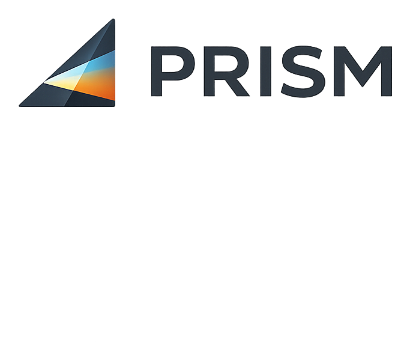

  

# PRISM
#### *Prompts · Research · Iteration · Synthesis · Master*

**A framework for LLM research and audits.**

PRISM keeps multi-prompt, multi-session LLM work coherent — across prompts, across sessions, and across the context limits of any single chat. It splits a research or audit problem into atomic specialist prompts, runs each one where it works best (Claude, Gemini, Perplexity, ChatGPT), and converges the outputs into a single living document called the **Starter**.

> *Prefer a 10-slide overview? See [`PRISM_teaser.pdf`](./assets/PRISM_teaser.pdf).*

---

## What it does

- **Multi-prompt by design.** One question too big for one prompt becomes a planned set of specialist prompts that add up to a whole.
- **Session-durable.** Project state lives in the Starter file. Any fresh session can pick up with *"What's next?"* and resume without memory loss.
- **Context-disciplined.** Monitors and Gates watch for version drift, context pressure, and missing inputs before they compound.
- **Self-driving at Setup.** You bring the subject and the goal; PRISM produces the Prompt Strategy. You approve; you don't author.
- **Foolproof per prompt.** Each prompt arrives as a complete execution package — text, attachments, which LLM to run it on, which mode. You paste and run.
- **Multi-LLM triangulation.** Cross-LLM convergence is a deliberate design feature, not a tooling convenience.

## When to use

- Product audits (competitive, technical, UX, content, strategy)
- Competitive landscape research
- Market sizing with cross-checked sources
- Investment due diligence
- Any research problem where a single prompt would be too shallow or too long to trust

## When not to use

- Simple factual lookups
- Analysis that fits comfortably in one prompt
- Creative work (writing, design) where divergent specialist passes don't add value

## How to use

1. Grab the PRISM framework file from this repo — either [`PRISM.md`](./PRISM.md) (stable filename, always the current version) or the versioned copy (see [Current version](#current-version) below) if you want the version visible in the filename.
2. Either:
   - **Attach it to a Claude session**, or
   - **Install it as a Claude Skill** (auto-triggers on any `*_starter_v*.md` or `*_audit_master*.md` file)
3. Hand Claude your subject and goal. PRISM takes it from there.

The framework runs on any capable LLM — Claude is the primary reasoning and build environment, with ChatGPT, Gemini, and Perplexity used in deliberate multi-vendor triangulation sequences.

## Current version

**v1.10.4** — file: [`PRISM_v1_10_4.md`](./PRISM_v1_10_4.md). See the `Version History` section at the bottom of the file for the full change log. Previous versions are available via git tags.

### Why versioned filenames?

PRISM is distributed primarily as a **file attachment**, not via `git clone`. The versioned filename lets the file self-document its version wherever it travels — attached to a Claude chat, installed as a Claude Skill, saved to a phone, shared between collaborators. You always know what version you're working with just by looking at the filename, without having to open the file or consult external metadata. [`PRISM.md`](./PRISM.md) is a byte-identical copy for anyone who wants a stable filename or a stable raw URL.

## Roadmap

Active proposals, deferred items, and declined ideas with rationale live in [`PRISM_backlog.md`](./PRISM_backlog.md) (versioned copy: [`PRISM_backlog_v6.md`](./PRISM_backlog_v6.md)). It's a working document — not canonical, not in force — kept separate from `PRISM.md` so the framework file stays authoritative. Useful if you want to see what's being considered, what's been decided against and why, or what's queued for the next version.

## Repository contents

- `PRISM.md` — the current framework version (stable filename, always up to date).
- `PRISM_v{n}.md` — versioned copy of the current framework (e.g., `PRISM_v1_10_4.md`). Previous versions available via git tags.
- `PRISM_backlog.md` — active/deferred/declined roadmap items. Working document, not canonical.
- `PRISM_backlog_v{n}.md` — versioned copy of the backlog (e.g., `PRISM_backlog_v6.md`).
- `README.md` — this file.
- `RELEASING.md` — maintainer workflow for tagging releases and bumping versions.
- `LICENSE-CC-BY-4.0.txt` — Creative Commons license, covers the framework docs.
- `LICENSE-MIT.txt` — MIT license, covers any code.
- `assets/` — logo, teaser deck (PPTX source + PDF), and other visual assets.

## Maintainer

Ron Kuper, with Claude as co-maintainer. Distilled from real-world competitive research and product audit projects, 2026.

## License

This repository is dual-licensed:

- **Framework documentation** (`PRISM.md`, any versioned `PRISM_v*.md` copy, and any other `.md` content except this README) is licensed under [Creative Commons Attribution 4.0 International (CC BY 4.0)](https://creativecommons.org/licenses/by/4.0/). See [`LICENSE-CC-BY-4.0.txt`](./LICENSE-CC-BY-4.0.txt).
- **Code** (scripts, tools, or any source files added in the future) is licensed under the [MIT License](https://opensource.org/licenses/MIT). See [`LICENSE-MIT.txt`](./LICENSE-MIT.txt).

You're free to use, adapt, and build on PRISM — including commercially — as long as you credit the project.
